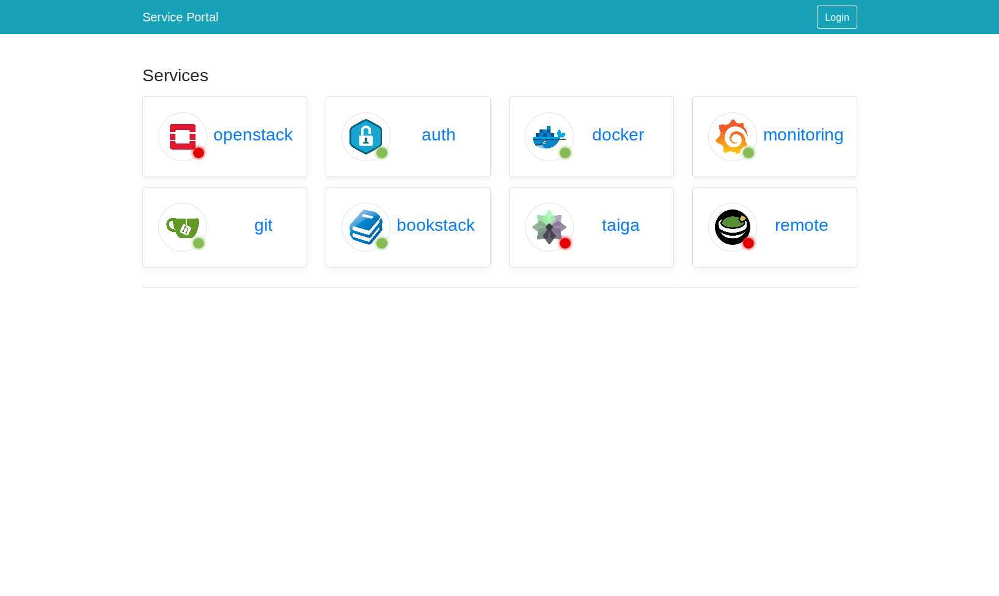
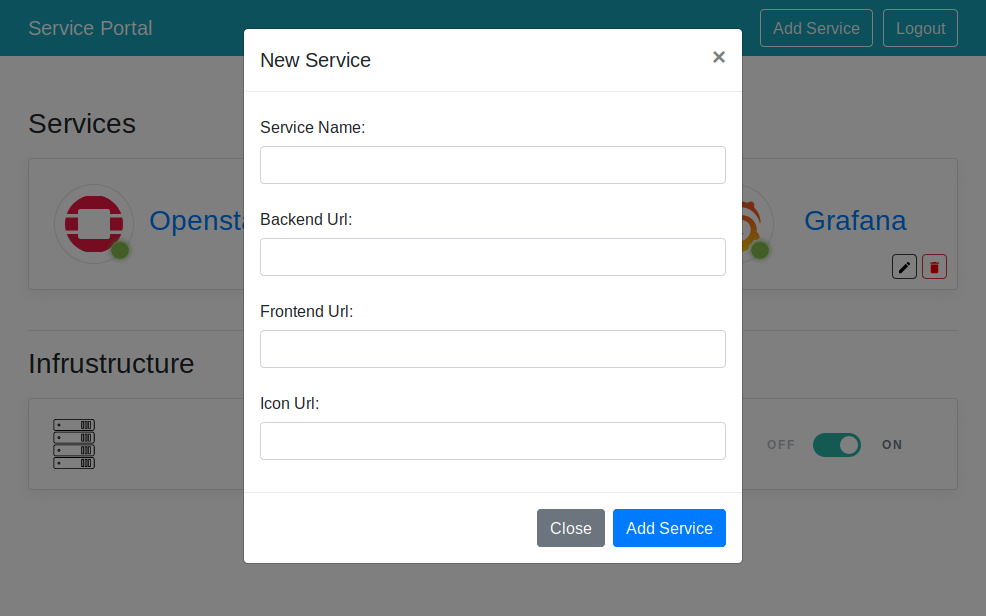

# Home Lab Portal
Just a simple golang service that reads a config file checks that it can reach the endpoints listed and beable to turn on and off my server via a remote powerswitch. The server is configured to boot on power.

Its mainly a pet project for me to experiment with golang again using a new go framework iris. 

The main page is protected by a very simple session cookie. Is is secure no, but better than nothing anyhow its only for internal use 

##### Traefik
Now includes some basic support for [treafik.io](https://traefik.io/) reverse proxy. Adding new services will update the proxy with the new routes. Support for this is very basic.


### Setup
Download the project then copy the config.example.json to config.json
Edit the config.json. 
```
{
  "Host": "127.0.0.1",
  "Port": 3000,
  "Username":"admin",
  "Password":"password",
  "Traefik": true,
  "Hosts":[
    "example.com"
  ]
}
```
The main parts are the host/port that the server will listen for connections.
username/password for the admin section
weather to enable the traefik proxy. If enabled new apps will automatically generate traefik rules.toml file for traefik to use. 
The host section should be populated with a list of hosts for traefik to route through.

In my setup I have 2 execptionerror.io and alpha.local. alpha.local in my internal dns while for some things like my gallery I want the public to access it which I use a vpn tunnel to route traffic from my webserver hosted in a VPS into my homelab. This way I dont have to open up my house IP to the world. you can find more about this here https://blog.robrotheram.com/2018/05/03/https-proxies-and-a-little-bit-of-golang/ 
The application **Does not come** traefik proxy. you will need to download that separately and point it at the rules.toml that the application generates. The docker container does bundle traefik proxy and this application together.

Once the config is done at minimum all you need to do (if on linux) is run the HomeLab binary ./HomeLabPortal (no building is needed) you can then go the url you setup in the config and click login.
Should now beable to add new services.

The settings to eddit are explained below: 
- The service name should also be the subdomain. ie gallery.hostname.com
- Backend url is for the proxy and is the url to send traffic to ie if you wanted gallery.hostname.com to be routed to 192.168.0.100:888*
- Frontend path is for the link in the ui so when you click on an app you go to service_name.hostname.com/frontend also can be left blank
- Icon url is the url for the icon you want to display.

Any updates to the ui gets applied to the config.json and will create the traefik rules.toml file you you to use with traefik.

The docker container bundles my app and the traefik proxy together.
If you have docker installed. all you need to to to build the container after you have created the config.json.

One Note the Dockerfile is currently setup to build on a linux X86 
 
If you are using raspberry-pi you will need to edit the Dockerfile and change the line
`COPY HomeLabPortal /HomeLabPortal/HomeLabPortal` and replace it with `COPY HomeLabPortal-arm /HomeLabPortal/HomeLabPortal`

To build the container  `docker build -t homelabportal .`

Now you have a docker container to run it
`docker run --name homelabportal -p 80:80 -p 8080:8080 -p 3000:3000 homelabportal`

The ui run on 3000 while the proxy is on port 80 and the treafik dashboard is on 8080
The portal will create a default route for you called portal so if you configure the dns to point portal.yourhosname.local at the container you will see the ui with no extra configuration
 
 
## Screenshot of the final result 



Edit mode



